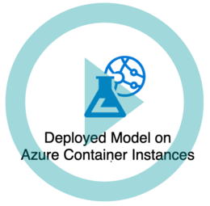

  < img width="200" src="https://github.com/Mufumi/Udacity-Optimizing-a-ML-Pipeline-in-Azure-Tutorial/blob/main/Azure%20Ml.jpg" alt="Azure Ml">

# Operationalizing Machine Learning in Azure

## Overview
This project is part of the Udacity Azure ML Nanodegree.
In this project we initialize, configure and deploy a Machine Learning model in MS Azure.

### Authentication

A crucial component of ML Ops is managing authentication of who has access to services in the environment. To ensure authentication can configured, the user has to ensure the Azure CLI is operational in the host machine. The Azure CLI is a cross-platform command-line tool that can be installed locally on Linux computers. The CLI on Linux allows the execution of various commands through a terminal using interactive command-line prompts or a script. Once the Azure CLI is installed and enabled, the user is expected to check the service principal has been activated. For this task, I used the machine provided by the lab and therefore did not go through any authentication process. It is crucial however to understand the fundamentals of authentication in ML Pipelines.  

### Set up Auto ML experiment

Once authentication is complete, the user can proceed to create the Auto ML run with the relevant dataset and initiate an Auto ML experiment.

  

[Azure-ML-Experiment.png]

For this excercise we used the Bankmarketing dataset. 
[Registered_Dataset.png]

This dataset contains customer data that is going to be used to find the best strategies to improve for the next marketing campaign. The aim is to deploy a model that will predict the effectiveness of the current marketing campaign. This experiment was conducted on a Standard_DS12_V2 compute cluster.

[Azure_ML_run.png]

[Get_detail_widget.png]

The best run's model is the Voting Ensemble with an accuracy of 91.864%

[Azure-ML-Experiment-Best-Run.png]

[Azure_ML_Pipeline_run.png]
[Azure_ML_Pipeline_run_2.png]

[Get_detail_widget.png]

### Deploy best model

For the deployment of the best performing model, the Azure Container Instance was utilized with authentication enabled. This authentication is critical as a control measure in the ML Ops framework.

### Enable logging

With az and Python SDK for Azure installed, a new Python3 virtual environment can be set up. The virtual environment is set up to create an isolated environment for Python projects. 

The logs.py file allows the user to view the logs of the application. 
[Experiment-logs.png]

Application insights is also enabled to gather more information about the application's run.
[Azure-ML-Application-Insights.png]

### Swagger

The Azure application produces a swagger file that is used to interact with the HTTP endpoints produced in the model. 

[Swagger-Domain-page.png]
[Swagger_GET_POST_methods.png]

The swagger.sh file pulls the latest swagger-ui docker image and then tries to run it on port 80. For my run, port 80 was already occupied considering the run was conducted on a Virtual machine. The server.py file script creates an HTTP server to expose the current working directory. It is meant to be an easy way to expose a local swagger.json file so that a swagger-ui service can pick it up from localhost.

[Swagger-ML-model-payload.png]

### Consume endpoints

Once the scoring uri and key are updated to match the running service, the endpoints can be consumed using the endpoints.py file. The output of the file displays the ability of the user to interact with the model endpoints.

[Running-endpoint.png]

### Benchmarking the model

The model can be then benchmarked with Apache running against the HTTP API using authentication keys to retrieve performance results.

[Benchmark.png]
[Benchmark_2.png]

### Create, publish and consume pipeline

#### Deploying model in Azure studio
  

#### Creating, publishing and consuming an ML Pipeline using Python SDK

## Application architectural diagram

## Future work
